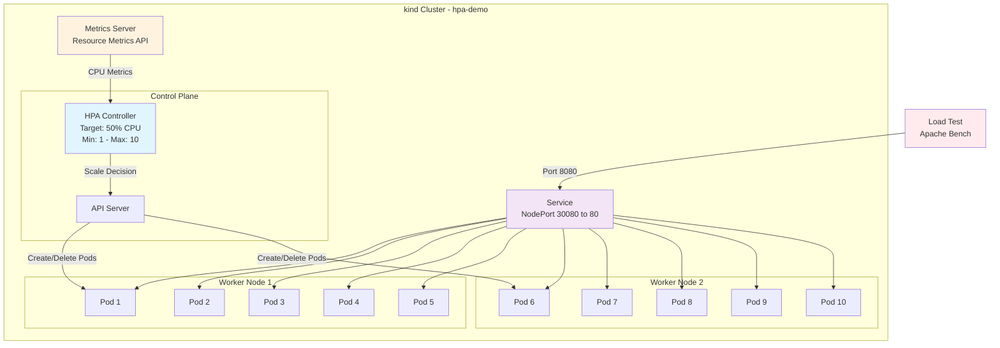

# Kubernetes HPA Example

Kubernetes cluster with Horizontal Pod Autoscaler (HPA) for auto-scaling PHP(🤮)+Apache(👴) application based on CPU utilization.

---

## Demo

Cumming Soon... 💦

---

## Project Structure

-   **app/** - PHP + Apache application with CPU-intensive simulated workload
-   **k8s/** - Kubernetes manifests (Deployment, Service, HPA)
-   **artifacts/** - Automation scripts for cluster, deployment, and testing
-   **results/** - Load test results, metrics timelines, and analysis

---

## Prerequisites

-   Docker
-   kubectl
-   kind
-   Apache Bench (ab) for load testing

## Quick Start

```bash
./artifacts/cluster-up.sh
./artifacts/app-deploy.sh
./artifacts/load-test.sh
```

---

## Setup Instructions

### 1. Create Cluster

```bash
kind create cluster --config kind-config.yaml --name hpa-demo
```

**Configuration**:

-   1 control-plane node
-   2 worker nodes
-   Port mapping: 30080 (NodePort) → 8080 (host)

Verify:

```bash
kubectl get nodes
```

### 2. Deploy Metrics Server

```bash
kubectl apply -f https://github.com/kubernetes-sigs/metrics-server/releases/latest/download/components.yaml

kubectl patch deployment metrics-server -n kube-system --type='json' \
  -p='[{"op":"add","path":"/spec/template/spec/containers/0/args/-","value":"--kubelet-insecure-tls"}]'
```

> The `--kubelet-insecure-tls` flag is used here for simplicity in a local kind cluster(not recommended for production 😛).

Wait for metrics server:

```bash
kubectl wait --for=condition=available deployment/metrics-server -n kube-system --timeout=120s
```

Verify:

```bash
kubectl top nodes
kubectl top pods
```

### 3. Build and Deploy Application

Build image:

```bash
docker build -t php-apache:local app/
kind load docker-image php-apache:local --name hpa-demo
```

Deploy manifests:

```bash
kubectl apply -f k8s/
```

Verify:

```bash
kubectl get pods
kubectl get svc
kubectl get hpa
```

Test application:

```bash
curl http://localhost:8080/
```

Expected output:

```
🐘 PHP Performance Report
==================================================
Processed in: 0.0167s
Hostname: php-apache-xxxxx
Iterations: 50,000

🦀 Rust says: [Random Rust fact]

💡 But hey, PHP still powers the web(80y programmers happy!) 🌐
```

---

## Load Testing

### Execute Test

```bash
./artifacts/load-test.sh
```

Or manually:

```bash
ab -n 50000 -c 30 http://localhost:8080/
```

### Monitor Scaling

Terminal 1 - Real-time monitoring:

```bash
./artifacts/monitor.sh
```

Terminal 2 - HPA watch:

```bash
watch -n 2 kubectl get hpa
```

Terminal 3 - Pod metrics:

```bash
watch -n 2 kubectl top pods
```

---

## Results

### Before Load Test

| Metric   | Value  |
| -------- | ------ |
| Replicas | 1      |
| CPU      | 24%    |
| Memory   | 24Mi   |
| Status   | Stable |

### During Load Test

| Metric        | Value              |
| ------------- | ------------------ |
| Max Replicas  | 10 (100% capacity) |
| Peak CPU      | 422%               |
| Time to Scale | ~90 seconds        |
| Scale Events  | 4 major scale-ups  |

### After Load Test

| Metric   | Value          |
| -------- | -------------- |
| Replicas | 10             |
| CPU      | 160% (16%/pod) |
| Memory   | 24Mi/pod       |
| Status   | Max capacity   |

### Scaling Timeline

| Time     | Replicas | CPU % | Event                         |
| -------- | -------- | ----- | ----------------------------- |
| 08:54:48 | 1        | 24%   | 📊 Baseline                   |
| 08:55:19 | 1        | 293%  | 🔥 Load started               |
| 08:55:29 | 3        | 293%  | ⬆️ Scale-up +2                |
| 08:55:50 | 6        | 390%  | ⬆️ Scale-up +3                |
| 08:56:01 | 10       | 422%  | ⬆️ Scale-up +4 (MAX REACHED)  |
| 08:56:12 | 10       | 422%  | ✅ Stabilized at max capacity |
| 08:56:43 | 10       | 379%  | 📈 Sustained high load        |

### HPA Analysis

**✅ Scale-Up Behavior**:

-   **Trigger Time**: ~30 seconds after load started
-   **Response**: Fast and aggressive (1→3→6→10)
-   **Policy**: 100% increase / +2 pods per 15s worked perfectly
-   **Result**: Successfully reached max capacity to handle load

**✅ Performance**:

-   **CPU Distribution**: Efficiently distributed across 10 pods
-   **Memory Usage**: Stable at 24Mi per pod
-   **Node Distribution**: Pods scheduled across 2 worker nodes
-   **Application**: Responsive throughout scaling events

**✅ Configuration Validation**:

-   Min/Max replicas: Correct (1-10)
-   CPU target: 50% - appropriate for triggering
-   Stabilization: Fast scale-up (0s), slow scale-down (60s)
-   Resource limits: Respected (500m CPU, 256Mi memory)

---

## Automation Scripts

### Cluster Management

-   `artifacts/cluster-up.sh` - Create cluster with metrics-server
-   `artifacts/cluster-down.sh` - Delete cluster

### Application Management

-   `artifacts/app-deploy.sh` - Build, load, and deploy application
-   `artifacts/app-undeploy.sh` - Remove application resources

### Testing

-   `artifacts/load-test.sh` - Run load test with metrics capture
-   `artifacts/update-results.sh` - Update results with fresh test
-   `artifacts/monitor.sh` - Real-time HPA and pod monitoring

---

## Architecture



### Resources

-   **Deployment**: `php-apache` (1-10 replicas)
-   **Service**: NodePort 30080→80
-   **HPA**: CPU-based autoscaling (50% target)
-   **Metrics**: Collected via metrics-server

---

## Cleanup

```bash
./artifacts/cluster-down.sh
```

Or manually:

```bash
kubectl delete -f k8s/
kind delete cluster --name hpa-demo
```
